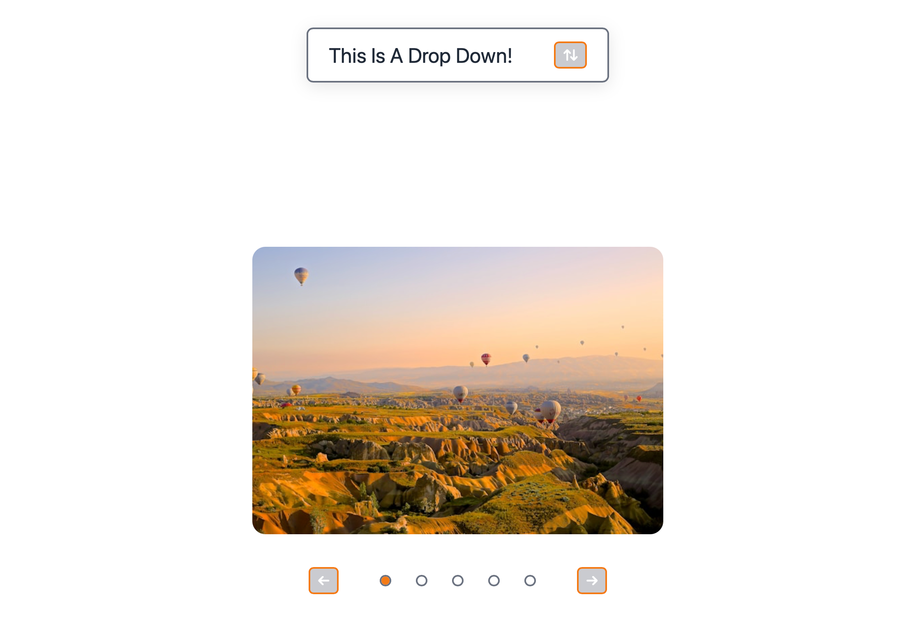

# User Interactive Interface

A simple, interactive web component demonstration showcasing dropdown menus and image carousels built with vanilla HTML, CSS, and JavaScript.



## Live Demo

[View Live Demo](https://theChosen-1.github.io/User-Interactive-Interface/)

## Features

### Dropdown Menu
- Collapsible menu with smooth animations
- Toggle button with arrow icon
- Clean hover states and transitions

### Image Carousel
- Navigate through images using arrow buttons
- Clickable dot indicators for direct navigation
- Smooth sliding transitions
- Wraps around at edges for continuous browsing

## Technologies Used

- **HTML5** - Semantic markup
- **CSS3** - Custom properties, Flexbox, transitions
- **JavaScript** - DOM manipulation, event handling

## What I Learned

This project was built as part of [The Odin Project](https://www.theodinproject.com/) curriculum. Key takeaways:

- Creating reusable UI components with vanilla JavaScript
- Managing state for interactive elements
- CSS transitions for smooth user experiences
- DOM manipulation and event listeners

## Project Structure

```
├── index.html      # Main HTML structure
├── styles.css      # Component styling
├── scripts.js      # Interactive functionality
└── Imgs/           # Carousel images
```

## Getting Started

1. Clone the repository
2. Open `index.html` in your browser

No build tools or dependencies required!

---

*Built as part of my full-stack development learning journey with The Odin Project*
